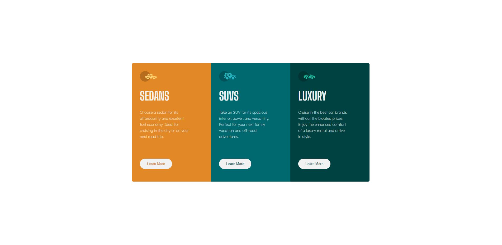
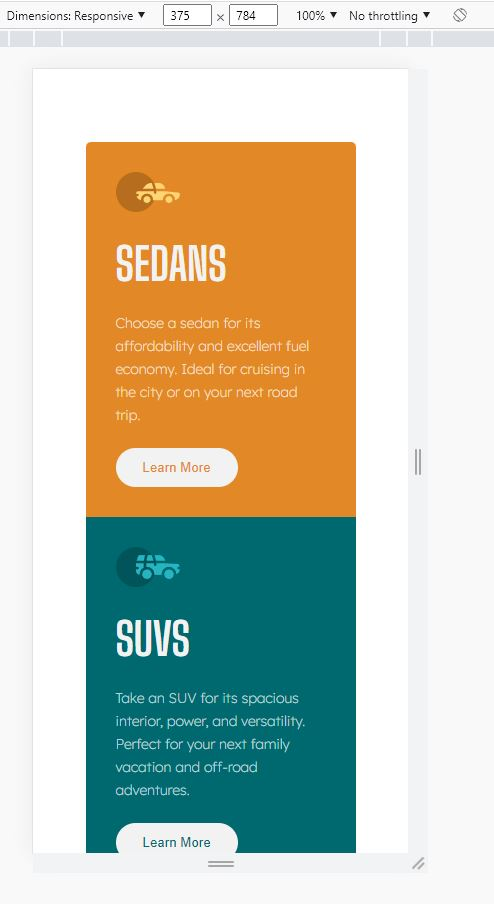

# Frontend Mentor - 3-column preview card component solution

This is a solution to the [3-column preview card component challenge on Frontend Mentor](https://www.frontendmentor.io/challenges/3column-preview-card-component-pH92eAR2-). Frontend Mentor challenges help you improve your coding skills by building realistic projects.

## Table of contents

- [Overview](#overview)
  - [The challenge](#the-challenge)
  - [Screenshot](#screenshot)
  - [Links](#links)
- [My process](#my-process)
  - [Built with](#built-with)
  - [What I learned](#what-i-learned)
  - [Continued development](#continued-development)
  - [Useful resources](#useful-resources)
- [Author](#author)
- [Acknowledgments](#acknowledgments)

**Note: Delete this note and update the table of contents based on what sections you keep.**

## Overview

### The challenge

Users should be able to:

- View the optimal layout depending on their device's screen size - ONLY OPTIMIZED FOR SCREENSIZE 375PX
- See hover states for interactive elements

### Screenshot

### Links

- Solution URL: [GitHub Rep](https://github.com/Roneeey/3columnpreviewcomp)
- Live Site URL: [GitHub Pages(https://roneeey.github.io/3columnpreviewcomp/)

## My process

### Built with

### Continued development

Moving on to next challenge

**Note: Delete this note and the content within this section and replace with your own plans for continued development.**
